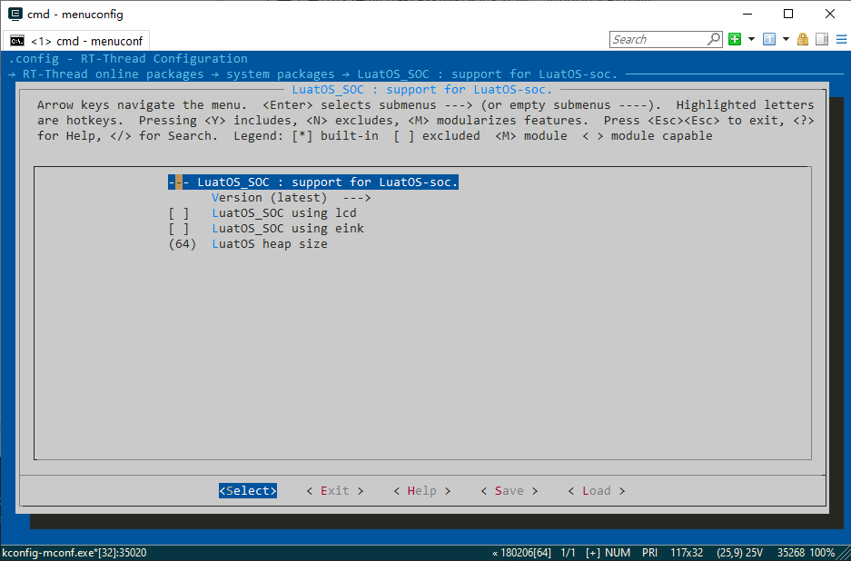

# LuatOS-SOC

## 1. 简介
LuatOS-SoC是一款实时操作系统,用户编写Lua代码就可完成各种功能, 仅需极少的内存和Flash空间，面向物联网设备的强大嵌入式Lua引擎，拥有众多组件。

1. 基于Lua 5.3.x脚本编程,无需编译,把Lua文本文件下载到设备即可完成开发

2. 低内存需求, 最低32kb ram, 96kb flash空间

3. 硬件抽象层兼容M3/armv7/risc-v/win32/posix等等,具有强大的扩展性

4. 可测试,可模拟,可裁剪,可扩展, 提供高效的开发效率

5. 基于合宙深耕的Lua-Task编程模型,实现异步/同步无缝切换

本软件包意在将LuatOS-SoC以软件包形式无缝巡行在RT-Thread上。

### 1.1目录结构
```shell
LuatOS-SoC
├───components
├───docs
│   └───figures                     // 文档使用图片
├───lua                             // 原版Lua 5.3.5, 含2019.12.31前已发布的官方修正
├───luat                          	// luat组件等
├───rt-thread                       // RTT对接文件
│   ├─── lib						// RTT适配文件
│   ├─── port						// 移植文件
├───LICENSE                         // 软件包许可证
├───README.md                       // 软件包使用说明
└───SConscript                      // RT-Thread 默认的构建脚本
```


### 1.2 许可证

LuatOS-SoC 软件包遵循 Apache-2.0 许可，详见 LICENSE 文件。

## 2. 获取方式

**LuatOS-SOC软件包相关配置选项介绍**



* `PKG_USING_LUATOS_SOC_LCD` 使用LCD组件,依赖SPI设备
* `PKG_USING_LUATOS_SOC_EINK` 使用EINK墨水屏组件,依赖SPI设备
* `PKG_LUATOS_SOC_LUAT_HEAP_SIZE` 配置LUAT_HEAP大小,单位Kbyte

## 3.使用方法


## 4.注意事项

报issue/提pr, 请到[luatos主库](https://gitee.com/openLuat/LuatOS)

## 5.联系方式

联系人：Dozingfiretruck

Email: 1473454180@qq.com

QQ群：1061642968

